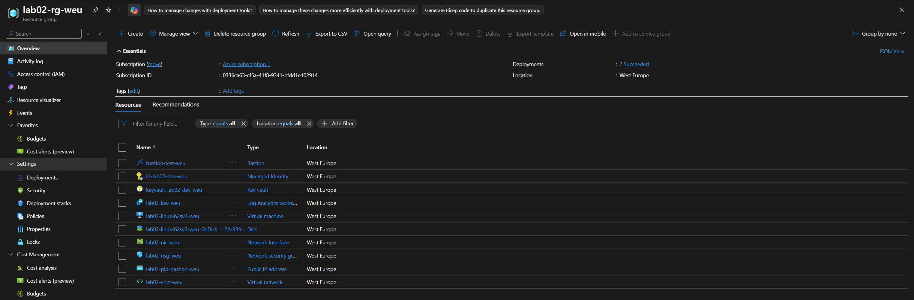

# LAB02 — Secure Automated Web App Infrastructure

## Architecture


---

## Project Structure

```
lab02
├── deploy.bicep
├── modules/
│   ├── network.bicep
│   ├── bastion.bicep
│   ├── identity.bicep
│   ├── keyvault.bicep
│   ├── rbac.bicep
│   ├── monitoring.bicep
│   └── vm.bicep
├── parameters/
│   └── dev.bicepparam
├── scripts/
│   └── cloud-init.yaml
├── evidence
│   ├── 01-validation.txt
│   └── 02-whatif.txt
├── images
│   └── 01-diagram.png
│   └── 02-deployment-succeeded.png
│   └── 03-resources.png
│   └── 04-bastion-ssh-connection.png
├── keys/
│   └── id_ed25519.pub
├── README.md
└── .gitignore
```

## Project Workflow
```
Git repo
   │
   ▼
Azure DevOps Pipeline
   │
   ▼
Resource Group

```

## Validation
```
az bicep lint --file deploy.bicep
```
```
az deployment sub validate \
  --name lab02-validation-v2 \
  --location westeurope \
  --template-file deploy.bicep \
  --parameters ./parameters/dev.bicepparam \
  --output json \
  > evidence/01-validation-lab02.json
```
## What-if
```
az deployment sub what-if \
  --name lab02-whatif-v1 \
  --location westeurope \
  --template-file deploy.bicep \
  --parameters ./parameters/dev.bicepparam \
  > evidence/01-whatif-lab02.md
```
## Deployment
```
az deployment sub create \
  --name lab02-deployment \
  --location westeurope \
  --template-file deploy.bicep \
  --parameters ./parameters/dev.bicepparam
  --output \
  > evidence/03-deployment-lab02.json
```
```
az deployment sub show \
  --name lab01-deployment \
  --query "{name:name,state:properties.provisioningState,timestamp:properties.timestamp}" \
  --output table
```
## Deployed resources

