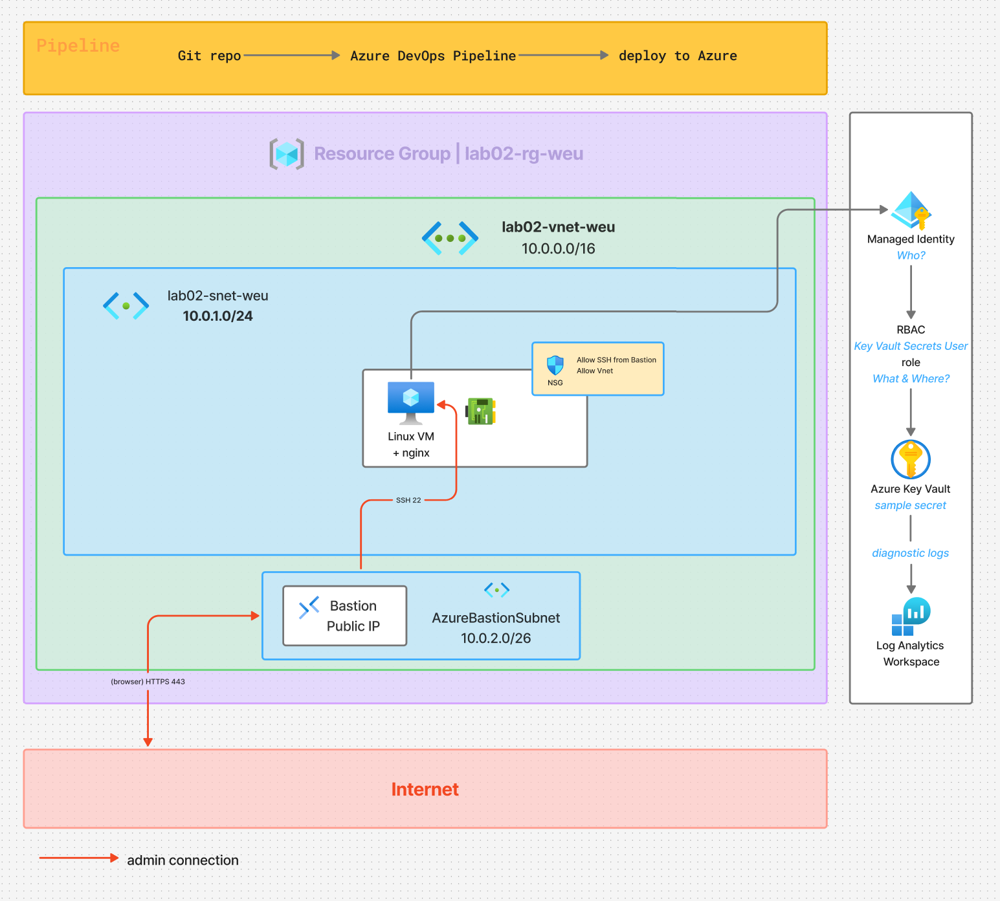

# LAB02 — Secure Automated Web App Infrastructure

## Architecture



---

## Project Structure

```
lab02
├── deploy.bicep
├── modules/
│   ├── network.bicep
│   ├── bastion.bicep
│   ├── identity.bicep
│   └── vm.bicep
├── parameters/
│   └── dev.bicepparam
├── scripts/
│   └── cloud-init.yaml
├── evidence
│   ├── 01-validation.txt
│   └── 02-whatif.txt
├── images
│   └── 01-diagram.png
│   └── 02-deployment-succeeded.png
│   └── 03-resources.png
│   └── 04-bastion-ssh-connection.png
├── keys/
│   └── id_ed25519.pub
├── README.md
└── .gitignore
```

## Project Workflow
```
Git repo
   │
   ▼
Azure DevOps Pipeline
   │
   ▼
Resource Group

```


│
├── VNet
│   ├── app-subnet
│   │    └── Linux VM
│   │         ├── nginx
│   │         └── Managed Identity
│   │
│   └── AzureBastionSubnet
│        └── Bastion
│
├── NSG
│
├── Key Vault
│    └── secret
│
├── Log Analytics Workspace
│
└── Monitoring / diagnostic settings